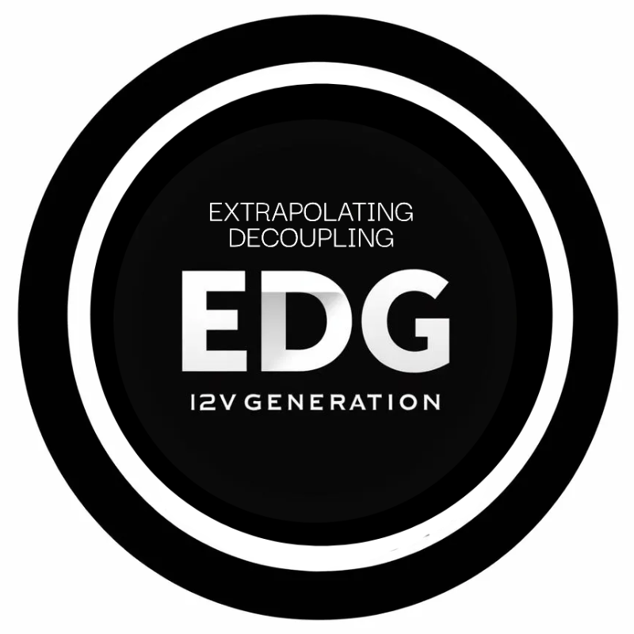
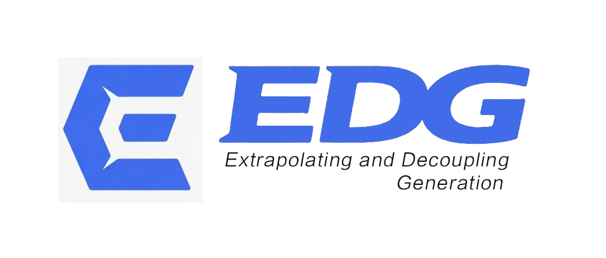

#  EDG (**E**xtrapolating and **D**ecoupling Image-to-Video **G**eneration)

  

## News
[2025-03-01] 🎉 **Our paper "Extrapolating and Decoupling Image-to-Video Generation Models:
Motion Modeling is Easier Than You Think" was accepted by *CVPR 2025*.**

[2025-03-01] 📢 We are more than happy to share our extrapolation and decoupling methods. However, we are currently overloaded at the moment. We will do our best to organize the code and release it as soon as possible.